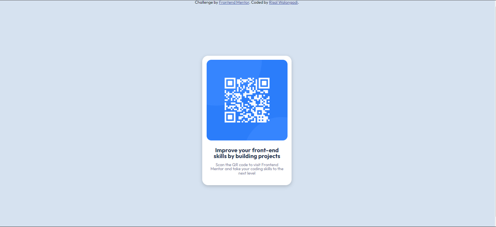

# Frontend Mentor - QR code component solution

This is a solution to the [QR code component challenge on Frontend Mentor](https://www.frontendmentor.io/challenges/qr-code-component-iux_sIO_H). Frontend Mentor challenges help you improve your coding skills by building realistic projects.

## Table of contents

- [Overview](#overview)
  - [Screenshot](#screenshot)
  - [Links](#links)
- [My process](#my-process)
  - [Built with](#built-with)
- [Author](#author)

## Overview

### Screenshot

### Links

- Solution URL: [Visit](https://www.frontendmentor.io/profile/izhal27/solutions)
- Live Site URL: [Visit](https://izhal27.github.io/qr-code-component/)

### Built with

- Semantic HTML5 markup
- CSS
- Flexbox

## Author

- Website - [Risal Walangadi](https://www.izhal.web.id.com)
- Frontend Mentor - [@izhal27](https://www.frontendmentor.io/profile/izhal27)
- Twitter - [@yourusername](https://www.twitter.com/gooner_izhal)
